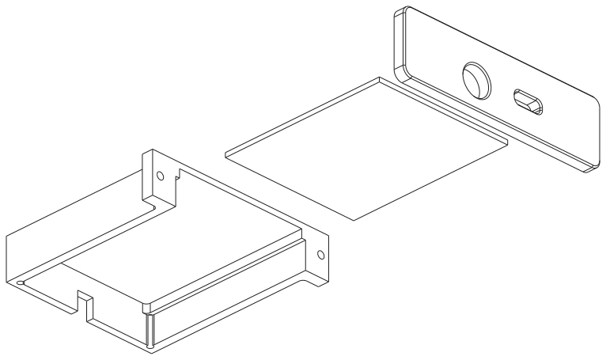

# violet-pcb-chassis

A parametric [CadQuery](https://cadquery.readthedocs.io) model for a two-part aluminium chassis
that carries a PCB into the edge of a musical instrument body and back out again for service,
without dismantling the instrument.

It emits a folded-sheet tray (STEP plus a flat DXF for cutting) and a machined faceplate (STEP).

<picture>
  <source media="(prefers-color-scheme: dark)" srcset="docs/exploded-dark.svg">
  
</picture>

## What it is

Two parts made two different ways, plus the board they carry:

- **Tray**: folded from 1.0 mm 5052-H32 sheet. A flat floor, two side walls, a back wall with a
  cable notch, and a flange at the front of each side wall. Five bends. The board sits on nylon
  standoffs with adhesive bases, which is what keeps its solder joints off the metal.
- **Faceplate**: machined from 6061 plate, because it needs tapped holes, countersinks and proud
  tabs that thin sheet cannot carry. It closes the aperture from outside, its two rear tabs drop
  between the tray's walls to register the parts, and it stands wider than the tray at each end
  so those ears can take the countersunk M3 screws that fix the unit to the instrument.

They go together like this:

1. Stick the standoffs to the tray floor, then screw the board down.
2. Screw the faceplate to the tray's front flanges from behind, on the bench.
3. Insert the whole module through the aperture from outside.
4. Fix the faceplate to the instrument body.

Because the module is assembled first and inserted as one piece, the entire tray envelope has to
pass through the routed aperture. The build prints the aperture size to rout.

**5052 rather than 6061 for the tray**: 6061-T6 cracks at tight bend radii and wants an inside
radius of three to four times material thickness. 5052-H32 folds happily at about one.

The forming parameters follow standard sheet-metal DFM rules, and the report prints each rule
next to what the design actually achieves: inside bend radius within 1 to 2 times thickness,
minimum flange of bend radius plus 4t, holes 4t clear of any bend and 2t clear of a sheared
edge. The wing flanges are sized by that hole-to-bend rule rather than by the M2 screw, since
the holes are punched while the sheet is flat and forming would pull them oval otherwise.

## Quick start

```bash
python3 -m venv .venv && .venv/bin/pip install -r requirements.txt
```

```bash
.venv/bin/python build.py
```

That checks the clearances, writes every part and preview to `out/`, and prints a
manufacturing report per variant: stock sizes, the aperture to rout, tooling, fastener
callouts and the PCB keep-outs.

Other things it does:

```bash
.venv/bin/python build.py --check
```

| Command | What it does |
| --- | --- |
| `build.py` | Everything: checks, exports, reports |
| `build.py --check` | Clearance checks only, no files written. Exit code 1 on failure |
| `build.py --list` | The defined variants and the build steps for each part |
| `build.py --spec cycfi` | One variant only |
| `build.py --spec cycfi --stage 2` | The tray part-way through its pipeline, to eyeball a single feature |
| `build.py --docs` | Regenerate the README image above. Not part of a normal build |

## What gets built

Per variant, in `out/`:

| File | What it is |
| --- | --- |
| `tray_flat_<name>.dxf` | **The flat blank**, outline on a `CUT` layer and bend lines on a `BEND` layer. For a folded part this is the file the shop cuts from |
| `tray_flat_<name>.svg` | The same blank rendered back out of that DXF, drawn 1:1 with the bends labelled, so you can look at it or print it and check |
| `sled_<name>.step` | The tray in its folded form |
| `faceplate_<name>.step` | The plate, for machining |
| `assembly_<name>.step` | Both parts and the board, fitted (separate named, coloured components) |
| `exploded_<name>.step` | The same, drawn apart in assembly order |
| `section_<name>.svg` | A slice through a standoff row, showing the gap under the board |
| `*.svg` | An isometric preview of each of the above |

## Configuring for your own board

Everything comes from a `ChassisSpec` in [`params.py`](params.py). `SPECS` maps a variant name
to one spec, and the build emits every entry; a second chassis for a different board is
therefore a second dictionary entry, not a second copy of the code.

Only the board's own numbers normally need touching:

| Field | Meaning |
| --- | --- |
| `pcb_w`, `pcb_depth`, `pcb_t`, `pcb_corner_r` | Board outline, thickness and corner radius |
| `top_clear` | Tallest component above the board |
| `board_holes` | The board's own mounting holes, which become the standoff positions (`x` from its centreline, `y` from its front edge) |
| `apertures` | Connector and control cut-outs, in the same frame |

Everything else is derived. Tray width, wall heights, flange and screw locations, the flat
blank, the plate outline and the aperture to rout all follow from those fields, and the two
parts share one source for the interface between them, so they cannot disagree about where the
screws go.

The remaining fields are fits, sheet and forming parameters, fastener sizes and tool diameters,
all with defaults. Two are worth knowing about:

- **`k_factor`** decides bend allowance, and so every dimension on the flat blank. It is
  shop-specific. The default of 0.38 is reasonable for 5052 at this radius, but confirm it with
  whoever is folding the part; the report prints it for exactly that reason.
- **`standoff_od`** interacts with `side_clear`. The standoffs have to bed on the genuinely flat
  part of the floor, which stops one bend radius short of each wall, so a larger standoff forces
  a wider tray. The validation says so explicitly, with the value to raise.

When you change the numbers, run:

```bash
.venv/bin/python build.py --check
```

It measures actual interference between the board (plus its component keep-out volumes) and
both parts, rather than trusting the arithmetic. It also checks that every standoff beds on flat
floor rather than lapping onto a bend, that the module fits its own reported aperture, and that
each part survived as a single solid. Finally, it flags cut-outs that would land on a folded
wall instead of the tray's opening, which is the mistake that quietly scraps a faceplate.

## Sources

The `cycfi` variant is built around the [Cycfi Nu Series](https://github.com/cycfi/nu) internal
breakout board. Its outline (50 x 35 mm), 1.5 mm corner radius, mounting holes and part
placement were taken from the Eagle layout at
[`internal_breakout.brd`](https://github.com/cycfi/nu/blob/dc334a32f05f/internal_breakout/internal_breakout.brd),
pinned at commit `dc334a32f05f`.

That work is by Cycfi Research and licensed
[CC BY-NC 4.0](http://creativecommons.org/licenses/by-nc/4.0/). None of it is redistributed
here; only dimensions were measured from it.

## Status

`cycfi` uses the real board outline. Two of its numbers are still assumptions: `pcb_t` (1.6 mm
standard stackup, since board thickness is a fabrication parameter and does not appear in a
layout file) and `top_clear` (15 mm, chosen to clear the 0.1 inch headers with mating sockets
and some strain relief, not measured off an assembled board).

`rmc` is still entirely **placeholder**, including its standoff pattern, which is inset from an
assumed outline rather than measured. Replace all of it before cutting metal.

Two things about the tray model are worth knowing when reading the STEP. Where the side walls
meet the back wall it runs material continuously round the corner, whereas the real part has a
bend relief there; the relief is in the flat pattern, which is what gets cut. And the flat
blank's area comes out about 4% under the folded solid's volume for exactly that reason, which
`--check` allows for deliberately rather than by loosening a tolerance until it passed.

The Cycfi board carries four M2 mounting holes inset 2.5 mm from its corners, currently unused
because the sled captures the board mechanically.

Fixing the plate to the instrument assumes **M3 threaded inserts** fitted into the body either
side of the aperture. The report prints where they go. Inserts rather than wood screws means the
plate can come off and back on repeatedly without chewing the timber, at the cost of fitting them
before first assembly.
